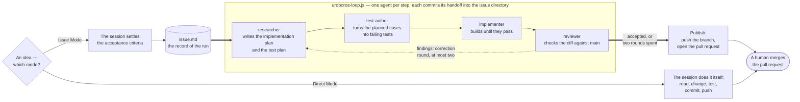

# uroboros

> An AI agent workflow that delegates: the conversation settles what is wanted,
> a scripted loop builds it — research, failing tests, implementation, review,
> correction — and a human steps in only where it matters.

**Uroboros** is the snake that eats its own tail. That is the principle, not
just the name: a run reviews and corrects its own work, and what a run learns
about the workflow is written back into the workflow. It ships as a Claude Code
plugin and assumes a modern Anthropic agent — at least Opus 5. The rules are one
page, [`CLAUDE.md`](CLAUDE.md); this one won't repeat it.

## Context is the scarce resource

A long-running agent gets worse as its context fills with everything it has ever
read. So each step gets its own agent and the smallest brief that does its job:
what a step needs is handed over in writing, what it does not need never
arrives. The chain is cut where a model cannot reliably judge its own work —
grading its own tests, reviewing a diff it just wrote. The session you talk to
is the most expensive context of all, so it never reads the codebase: it settles
the acceptance criteria, writes them to an issue, and hands that issue to a
script.

## The loop corrects itself, and the issue is the record



The steps are [`researcher`](agents/researcher.md),
[`test-author`](agents/test-author.md), [`implementer`](agents/implementer.md)
and [`reviewer`](agents/reviewer.md), run by a script
([`.claude/workflows/uroboros-loop.js`](.claude/workflows/uroboros-loop.js)) and
not by an agent, because a subagent cannot start another one. Findings from the
review open a correction round; after two the loop stops and hands back.

Whether, what and how to test is decided once, by the researcher — the only
agent that reads the codebase — in a Test Plan section of its handoff. The
test-author writes those cases and no others, the implementer trusts the
decision instead of judging it, and the reviewer, which reads no handoff at all,
checks the result against the intent and so remains the check on that plan.

The plan also closes the list of commands the change is judged by, and the loop
hands that list to the implementer and the reviewer. Nobody runs a suite or a
linter it leaves out, and an empty list means the review is a reading — so the
cost of checking is a decision made once, with the codebase in view, instead of
four agents each reaching for `test.sh` to be safe.

Every agent commits its handoff into `docs/issues/<timestamp>-<slug>/`, so the
record of a run is the issue and not anyone's context window. That is what makes
unattended work possible: idea to pull request with nobody at the keyboard, and
a session picking the work back up hours later resumes from the record rather
than from a conversation that is gone.

Which mode a task runs in, the human names. **Direct Mode**: the session does it
itself, no issue file and no subagent. **Issue Mode**: the loop above — and for
an idea too vague to write criteria for, the [`grill`](skills/grill/) skill gets
there one question at a time.

## It improves itself

After a run, the [`retro`](skills/retro/) skill reads the session log and
records what got in the way. A rule that keeps misfiring becomes a proposed
change to the rulebook itself, reviewed like any other pull request. Every wired
project loads uroboros fresh at session start, so an accepted fix reaches all of
them with their next session — the workflow gets better at being followed
without a human rewriting it by hand. To have the retros land in *your*
rulebook, fork this repository and point `marketplace add` at the fork.

## Installing it

```bash
claude plugin marketplace add artkoenig/uroboros
claude plugin install uroboros@uroboros
```

A session then gets the rulebook of the current `main`, the subagents, the
skills, a self-check saying what of that is actually reachable, and a `pre-push`
guard that refuses a direct push to the default branch — unless the project
manages its own git hooks, which uroboros leaves alone and reports. Updates come
with the next session, not with a re-installation.

## Working in parallel

```bash
claude --worktree feature-auth   # its own checkout under .claude/worktrees/
```

`worktree.baseRef` is pinned to `"fresh"`, so a new worktree branches from the
default branch rather than from unpushed work, and the push guard holds inside
it. Gitignored files a run needs are listed in
[`.worktreeinclude`](.worktreeinclude) and copied into every new worktree.

## tools/

| Tool                              | Purpose                                                                                                                |
| --------------------------------- | ---------------------------------------------------------------------------------------------------------------------- |
| [`argus`](tools/argus/)           | OpenTelemetry collector for agent sessions: traces, tokens, cost, tool calls, errors. Ingests, aggregates, serves JSON. |
| [`argus-ui`](tools/argus-ui/)     | The page that shows what a collector holds. Local only — started from a checkout, never deployed.                      |
| [`log-parser`](tools/log-parser/) | Reads a Claude Code or Gemini/Antigravity session log into markdown and metrics. What the `retro` skill runs.           |

```bash
argus start --background                     # collector, http://127.0.0.1:4318
node tools/argus-ui/bin/argus-ui.mjs         # interface, http://127.0.0.1:4319
bin/parse-agent-log --latest auto            # the last session as markdown
```

`argus` is on the `PATH` of every session with the plugin enabled, so any
project can measure itself; the [`argus`](skills/argus/) skill carries the
procedure. It all runs on your own machine — no account, no third-party service.

## Tests

`bash test.sh` — six suites, one command: the repository's own rules, the plugin
manifests and the session-start hook, parallel runs in worktrees, and the three
tools.

## Licence

GPL-3.0-or-later — see [LICENSE](LICENSE).
