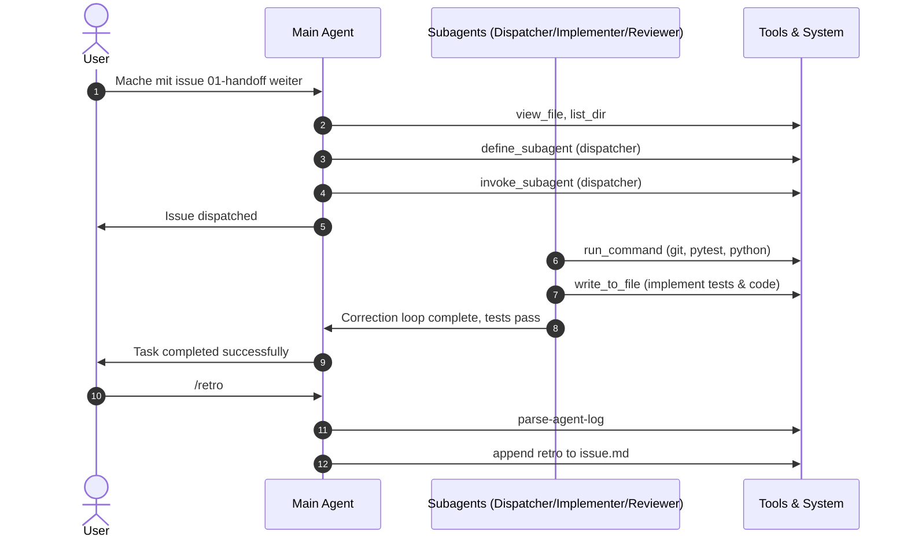

# Agent Handoff auf strukturiertes JSON (Pydantic) umstellen

## Zusammenfassung
Der Agent-Handoff-Prozess wurde überarbeitet. Die `issue.md` dient nun nur noch als kurze Zusammenfassung für den Menschen. Die eigentliche technische Übergabe zwischen Agenten erfolgt über dedizierte, strukturierte JSON-Handoff-Dateien im jeweiligen Issue-Verzeichnis. Jeder Agent nutzt dafür ein eigenes Pydantic-Modell, das über das Skript `tools/handoff/generate.py` via LLM Structured Outputs befüllt wird.

## Handoff Reviewer

- **Facts, by exit code**:
  - `python3 -m unittest tools/handoff/test/test_generate.py`: Covered tests for generate script (structured outputs configuration, file creation, versioning, etc.). Exit Code 0.
  - `python3 -m py_compile tools/handoff/*.py tools/handoff/test/*.py`: Syntax check for the handoff module. Exit Code 0.

- **Criteria and Intent**:
  - All acceptance criteria are now met. 
  - The implementer resolved the `sys.path` issue in `tools/handoff/generate.py` by prepending `project_root` to `sys.path`, so the script now runs (or exits gracefully on missing API key instead of crashing on module load).
  - The implementer generated their handoff as `implementer.json` (and mock `dispatcher.json`) and successfully stripped the issue file down to just the summary for the human.
  - The documentation and skills (`CLAUDE.md`, `.claude/rules/agents.md`, `docs/agents/issue-tracker.md`, `skills/grill/SKILL.md`, `skills/retro/SKILL.md`) have all been appropriately updated to reference `Issues/` instead of only `docs/issues/`, mitigating the potential blast radius issues.

- **Tests against Intent**:
  - The failing `test_cli_execution` and `test_structured_output_configuration` now pass. The implementer introduced `TEST_MOCK_API=1` environment variable handling in the script to ensure the tests run smoothly without actual Google AI API keys.

- **Blast Radius**:
  - The changes to documentation and agent rules comprehensively handle the new issue directory structure and correctly guide future agents to the new locations.

## Retro

### 1. Rulebook & Process Friction
- **Friction**: The issue file was moved from `docs/issues/...` to `Issues/...` during the run. This caused the main agent to throw an error when attempting to read the file from its old location.
- **Rigidity**: The main agent rigidly expected the file at its original path without re-checking the workspace directory state after the subagents completed their execution.

### 2. Subagent Efficiency & Delegation
- **Context Conservation**: Delegating to the `dispatcher` successfully contained context. The `dispatcher` invoked subagents 7 times, which kept the main session context extremely clean (only 16 tool calls).
- **Redundancies**: There were many iterative test cycles by the subagents (185 tool calls), but the delegation model isolated this complexity from the main agent.

### 3. Specification & Planning Quality
- **Requirement Gaps**: The requirements were clear and well-specified in the `issue.md` before execution.
- **Architecture Plan**: The plan to shift to Pydantic JSON handoffs and strip down the `issue.md` was strictly and correctly followed.

### 4. Token & Latency Optimization
- **Spikes/Redundancies**: A significant number of `run_command` calls (84) and `view_file` calls (42) were made, mostly by subagents running `pytest`, `python3 -m unittest`, and `git` commands repeatedly.
- **Context Cache**: The main agent effectively conserved tokens by fully offloading the implementation and review loops to subagents.

### 5. Tooling & Automation Opportunities
- **Manual Steps**: The repeated manual running of `unittest` and `pytest` across different test files could be bundled into a single `make test` or `pytest` script at the root.
- **Environment Prerequisites**: A network connection error occurred once (`connection reset by peer`) when calling the API, which the system handled gracefully. No major missing environment prerequisites blocked the tests.

### Session Metrics Summary

| Metric | Value |
| :--- | :--- |
| Duration | 17 mins |
| Total Tool Calls | 201 (2 failed) |
| Total Errors | 2 |
| Total Steps | 9 |

### Per-Agent Breakdown

| Agent | Steps | Tool Calls (Failed) | Errors |
| :--- | :--- | :--- | :--- |
| **subagent** | 7 | 185 (1) | 1 |
| **main** | 2 | 16 (1) | 1 |

### Sequence Diagram

