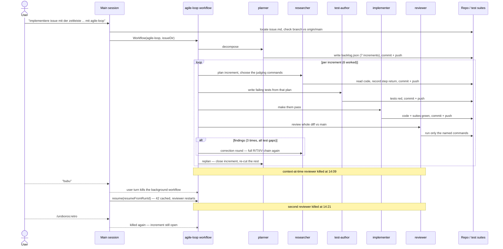

# A session timeline as the argus UI's central view

## Problem

The argus UI is technical: it shows many numbers and raw records, and the
overview gets lost in them. What the human actually wants to see is how a
session develops over time — which agents are running at a given moment, what
the context of the main session and of each agent looks like at that moment
(the exact content, as text), and which tools each agent has used up to that
point and with what parameters. The purpose is to optimize the workflow as a
whole and to reduce token consumption: the view has to make visible *where*
context grows and *what* fills it.

The control the human asked for is a timeline: scrub the session backward and
forward, or let it follow live.

Today the data for this only partially arrives. The OTLP export carries
metrics, events and spans with timestamps and agent attribution
(`agent.name`, `skill.name` on spans), but all content is behind opt-in flags
that `argus env` does not set: prompt text needs `OTEL_LOG_USER_PROMPTS`,
tool parameters need `OTEL_LOG_TOOL_DETAILS`, tool result content needs
`OTEL_LOG_TOOL_CONTENT`, and the full request/response bodies — the event
names `claude_code.api_request_body` / `claude_code.api_response_body` are
already known to `tools/argus/src/claude.mjs` — need whatever flag the CLI
requires for them. An API request body *is* the context at the time of that
request, which makes OTLP alone a sufficient source once the flags are on.

## Acceptance criteria

- [ ] `argus env` (both formats) includes the content flags by default:
      user prompts, tool details, tool content, and the flag(s) required for
      the CLI to emit `api_request_body`/`api_response_body` events. The
      researcher verifies the exact flag names against the CLI's monitoring
      documentation; if request/response body events turn out not to be
      emittable by the current CLI, that is reported as a finding and the
      context view is built from the best content the flags do provide.
- [ ] The collector stores and serves what those events carry, so the UI can
      ask for the context belonging to a point in time; content-bearing
      records are exposed over the JSON API like the existing signals.
- [ ] Opening a session in the argus UI lands on the timeline view. The
      previous technical views (event tail, traces, raw inspectors) remain
      reachable from it, subordinate to the timeline — not the other way
      round.
- [ ] The timeline draws one lane for the main session and one lane per
      subagent, each agent lane spanning that agent's lifetime, so "which
      agents are running at this moment" is answered by looking at any
      vertical slice.
- [ ] Each lane shows its activity over time (tool calls, API requests) and,
      as a curve or area behind it, the context size over time, so growth in
      token consumption is visible on the timeline itself without opening
      any detail.
- [ ] The timeline can be scrubbed backward and forward to any point of the
      recorded session, and offers a live mode that follows the newest data
      as it arrives; scrubbing away from the head leaves live mode, and a
      control returns to it.
- [ ] Selecting a lane at the chosen time shows that agent's (or the main
      session's) context as of that moment: the body of the nearest API
      request at or before that time, rendered as a structured message list —
      system prompt, user, assistant, tool call, tool result — each block
      collapsed to one line with its size, expandable to the exact full
      text.
- [ ] Selecting a lane at the chosen time also shows the tools that agent
      has used up to that moment, with tool name and the call's parameters,
      so "which tools, and what for" is answerable per agent and per time.
- [ ] Recordings made without the content flags are out of contract: no
      fallback rendering, no compatibility notice is required, and no test
      pins behavior for them (decision: no such recordings exist).
- [ ] `./test.sh` is green.

## Out of scope

- Reading session transcripts (JSONL) as a second data source. OTLP with the
  content flags is the single source.
- Backward compatibility with telemetry directories recorded before this
  change.
- Cross-session comparison on one timeline; the view shows one session.
- Any change to how the collector is started or discovered.

## Decisions

Recorded from the grilling interview, 2026-08-06:

1. **Data source: OTLP only, content flags on by default in `argus env`.**
   The human asked for the OTLP contents to be checked rather than assumed;
   the check (in `tools/argus/src/claude.mjs`, `store.mjs`) showed OTLP
   carries everything needed once the opt-in content flags are set, so the
   human chose to make them the default over an `--content` opt-in or a
   split default. Consequence: the whole conversation content lands in the
   gitignored telemetry directory; accepted, since argus is a local
   measurement tool and measuring is the point.
2. **The timeline is the central session view**, not an additional tab and
   not a full replacement that deletes the technical views: those remain
   reachable but subordinate. Chosen because the complaint is precisely that
   the overview drowns among technical views.
3. **Context is rendered as a structured, expandable message list** rather
   than as raw full text (or a toggle between both). One line + size per
   block collapsed, exact full text on expand — chosen so what fills the
   context is visible at a glance while every character stays reachable.
4. **The timeline itself draws lanes with activity blocks and a context-size
   curve per lane** — not bare activity lanes, not a single marker strip.
   Chosen because seeing where consumption explodes without clicking is the
   missing overview.
5. **No handling for recordings without content flags.** The human states no
   old recordings exist; the degradation question was dropped rather than
   decided, so nothing may test or promise behavior for that case.

## Assumptions taken as defaults (no explicit answer needed)

- "Real time" means the live mode above: the timeline follows the newest
  data, and scrubbing pauses the following. No playback-speed machinery is
  asked for.
- Subagent lanes depend on the telemetry attributing records to agents
  (`agent.name` and related attributes on spans/events). The researcher
  verifies what attribution actually arrives for subagent activity and
  request bodies; if the CLI attributes subagent traffic incompletely, the
  lanes show what is attributable and the gap is reported as a finding, not
  silently papered over.
- The UI work happens in `tools/argus-ui`, the collector/API work in
  `tools/argus`, matching the existing split (the collector stays headless).

## Retro

Session of 2026-08-07, 09:09–14:21 UTC (5h 12m wall), running
`uroboros:agile-loop` over this issue. Sources: the main session log, the 44
subagent transcripts and `journal.jsonl` under the workflow run
`wf_fe6db294-b60`, `backlog.json`, and the git history of
`claude/argus-zeitleiste-agile-loop-knnzsj`.

**State at the time of writing: the run is not finished.** Five of the seven
increments the planner cut are closed, one (`tools-at-time`) was dropped as
absorbed by `lane-select`, and `context-at-time` is implemented and committed
(`a3750f1`) but unreviewed — its reviewer was killed twice.

### Session Metrics Summary

| Metric | Value |
| :--- | :--- |
| Wall time | 5h 12m (09:09–14:21 UTC) |
| Total tokens | 77,590,119 |
| — main session | 1,469,097 (1.9%) |
| — subagents | 76,121,022 (98.1%) |
| Uncached tokens (input + cache creation) | 3,655,232 (4.7%) |
| Cache read share, subagents | 95.3% |
| Cache read share, main session | 91.2% |
| Output tokens (all agents) | 53,720 |
| Subagents spawned | 44 (42 returned, 2 killed) |
| Tool calls | 1,331 (1,306 subagent + 25 main), 11 failed |
| Commits | 30 |
| Increments closed / dropped / open | 5 / 1 / 1 |
| Correction rounds | 3, all of them test gaps rather than defects |

Spend by segment, in journal order:

| Segment | Agents | Tool calls | Tokens |
| :--- | ---: | ---: | ---: |
| Setup + decompose | 2 | 15 | 297,113 |
| `content-pipeline` | 4 | 155 | 9,195,185 |
| `timeline-landing` round 1 | 4 | 153 | 11,284,702 |
| `timeline-landing` round 2 (correction) | 4 | 70 | 2,114,110 |
| `timeline-landing` round 3 (correction) | 4 | 113 | 4,469,814 |
| `lane-activity` | 4 | 159 | 12,230,385 |
| `scrub-live` | 4 | 107 | 5,462,600 |
| `lane-select` round 1 | 4 | 157 | 9,131,145 |
| `lane-select` round 2 (correction) | 4 | 70 | 2,763,303 |
| `context-at-time` (unfinished) | 5 | 224 | 16,249,023 |
| Replan steps (4×) | 4 | 55 | 1,653,611 |

### Per-Agent Breakdown

| Agent | Runs | Steps | Tool calls (failed) | Output tokens | Total tokens | Share |
| :--- | ---: | ---: | ---: | ---: | ---: | ---: |
| **main** | 1 | 8 | 25 (1) | 7,384 | 1,469,097 | 1.9% |
| implementer | 9 | 18 | 363 (2) | 16,697 | 24,061,456 | 31.0% |
| researcher | 9 | 18 | 314 (5) | 9,262 | 19,723,715 | 25.4% |
| test-author | 9 | 18 | 266 (2) | 4,365 | 17,516,692 | 22.6% |
| reviewer | 10 | 22 | 275 (0) | 6,937 | 12,337,933 | 15.9% |
| planner | 6 | 12 | 86 (0) | 9,073 | 2,428,321 | 3.1% |
| general-purpose | 1 | 1 | 2 (1) | 2 | 52,905 | 0.1% |

Tool use across the subagents: Bash 774 (9 failed), Read 259 (1), Edit 149,
Write 48, StructuredOutput 42, Grep 29, WebFetch 5. The main session used
Bash 18, Workflow 2, TaskOutput 3 (1), Skill 1, ToolSearch 1.

### Sequence Diagram

### 1. Rulebook & Process Friction

**Which process rule or automated hook created disproportionate friction?**

Commit signing. A researcher's `git commit` exited 128 with
`Key file set to "/home/claude/.ssh/commit_signing_key.pub" (ignored, using
server key)` followed by `signing failed`. Every agent in the chain commits
and pushes its step return, so this hook sits on 44 mandatory paths per run;
a failure there blocks a step that has otherwise already done its work. The
key path (`/home/claude/…`) does not match the session's actual home, which
makes this an environment mismatch rather than a transient error.

Second, the recorder's strict JSON gate. `backlog.mjs record` rejected a step
return with `is not valid JSON: Expected ',' or '}' after property value` —
the researcher had embedded HTML attributes (`data-lane-id=\"main\"`) in a
summary written through a Bash heredoc. Recovering cost a debugging detour
(`od -c` on a probe file, a `node -e` attempt) and one further rejection from
the harness itself: `command contains control characters that would be hidden
in the approval dialog`. Three failed calls to hand a string to a recorder.

**Where did the agent apply rules too rigidly, causing unnecessary overhead?**

The "every step commits and pushes its return" rule ran unchanged through
steps that changed nothing. Two commits say so in their own subject lines:
`d400b64 Record the round-1 implement step: geometry already pinned` and
`2ea9c04 Implement lane-select.1: verify the lane-detail guards, no code
change`. When a reviewer's finding is "the behaviour is right but untested",
the correction protocol still spends a full four-agent chain — researcher,
test-author, implementer, reviewer — to add assertions and confirm the
implementer had nothing to do. That shape cost 2,114,110 tokens for
`timeline-landing` round 2 and 2,763,303 for `lane-select` round 2.

A correction round whose findings are all test gaps has no work for the
implementer. Letting the reviewer's verdict route to a test-only round
(test-author → reviewer) would have saved roughly a third of those two rounds.

### 2. Subagent Efficiency & Delegation

**Did delegating conserve context, or was briefing overhead larger than the gain?**

Delegation conserved context decisively. The main session ended at 1,469,097
tokens — 1.9% of the run — after five hours, 25 tool calls and eight steps,
while the subagents made 1,306 calls and spent 76.1M. The main session never
read the argus source at all. Briefing overhead is visible and small: total
cache creation across all 44 agents is 3,517,009 tokens (4.6% of subagent
spend), which is what it cost to hand every agent its structured prompt and
issue file from scratch.

**Were there redundancies or repeated research between the main conversation and subagent runs?**

None between main and the subagents — main did no research beyond locating
`issue.md` and comparing the branch to `origin/main` (3 Bash calls).

Inside the workflow, yes: the correction protocol re-runs the researcher, so
`timeline-landing` paid for its increment to be researched three times
(2,927,084 + 393,992 + 1,068,481). The correction researchers are much cheaper
than the round-1 one, which shows the reviewer's findings arriving in the
prompt do narrow the work — the redundancy is the mandatory full chain, not
the researcher's own behaviour.

One genuine saving is worth recording: the fake-DOM harness introduced during
`timeline-landing` round 2 (`tools/argus-ui/test/app.test.mjs`) was reused by
every later UI increment, and the `lane-activity` and `scrub-live` increments
that inherited it closed with zero correction rounds.

### 3. Specification & Planning Quality

**Were critical requirement gaps uncovered upfront, or did ambiguities surface late?**

Upfront, largely — and where the spec could not know the answer it said so
instead of guessing. The issue explicitly instructed the researcher to verify
the flag names against the CLI documentation and to report an attribution gap
as a finding rather than paper over it. Both hedges paid: `content-pipeline`
confirmed the four flags and reported the real gap (body events carry
`query_source` and span context but no `agent.name` or `agent_id`), and every
later increment was cut against that fact rather than against an assumption.

The gap that did surface late was not a requirement but a standard of proof.
Nothing in the original criteria demanded that a change be visible in the
rendered page, so `timeline-landing` shipped behaviour computed by a tested
pure helper and never pinned in the markup — twice. Only after that did the
planner start writing a provability criterion into each increment ("What
proves this increment is the drawn result in the page…"). Correction rounds
per increment after that change: 0, 0, 1. That criterion belonged in the issue
from the start and is the single cheapest lesson of this run.

The first cut also over-split: `tools-at-time` was created as its own
increment and later dropped because `lane-select` had absorbed it. Harmless —
the re-cut caught it before any agent worked it — but it shows the decompose
step guessing at boundaries the code had not yet revealed.

**Was the architecture plan strictly followed, or were there unauthorized deviations?**

Followed, and the deviations that happened were declared rather than silent.
The `context-at-time` implementer recorded two, each with a reason: it factored
the plan's inline detail repaint into a shared `renderLaneDetail()` because the
fake DOM resolves elements by id independently of a parent's `innerHTML`, and
it put the truncation ellipsis in a sibling `` so the `<code>` element
holds exactly the collector's characters and nothing invented. Both are
narrower than what the plan allowed, and both were reported in the step return.
No unauthorized deviation appears anywhere in the 42 returns.

### 4. Token & Latency Optimization

**Where did token spikes, redundant tool loops, or uncompacted outputs occur?**

Three places, in order of cost:

1. **A user turn kills the running workflow — 2,177,588 tokens lost.** The
   `context-at-time` reviewer was killed at 14:09, coincident with a user
   message; the resumed run's replacement reviewer was killed at 14:21,
   coincident with `/uroboros:retro`. Resume works well — the journal replayed
   42 cached results instantly — but the interrupted agent restarts from zero,
   so the same review has now been paid for twice and still has no verdict.
2. **Correction rounds: 9,347,227 tokens, 12.3% of subagent spend**, all three
   for test gaps rather than defects, and two of the three for the *same* trap:
   the fake DOM conjures an element for any id, so a panel assertion that reads
   only that element stays green after the container is deleted from the
   rendered markup.
3. **Single-agent spikes.** The `context-at-time` implementer alone spent
   6,723,993 tokens (8.7% of the run) over 16 minutes; the `timeline-landing`
   round-1 implementer 5,701,386. Both are increments whose criteria list ran
   to eight bullets — increment size maps almost linearly onto implementer cost.

Latency is entirely serial by design: 5h 12m of wall time with no two phases
ever overlapping. Nothing in this issue's increments was independent enough to
parallelise, but the replan step (four runs, 1.65M tokens, ~2 minutes each)
sits on the critical path purely to re-cut increments that mostly did not
change.

**How efficient was context cache utilization across steps?**

Very. 95.3% of subagent tokens and 91.2% of main-session tokens were cache
reads; only 3,655,232 of 77,590,119 tokens (4.7%) were uncached. The 77M
headline is re-reads of already-cached context, not fresh computation — each
agent pays its brief once and then reads. There is no cache-thrash pattern
anywhere in the run.

### 5. Tooling & Automation Opportunities

**Which recurring manual steps should be encapsulated into a CLI tool?**

- **Handing a step return to the recorder.** `backlog.mjs record` takes a path
  to a JSON file, and building that file in a Bash heredoc is where the
  escaping broke. A `--summary-stdin` mode, or per-field flags, would delete
  the whole escaping surface and the three failed calls it produced here.
- **Checking whether a background workflow is alive.** During this session the
  workflow was reported as running on the strength of transcript file
  timestamps while it was already dead; the authoritative check is `TaskOutput`
  on the task id. A `bin/` helper that prints a run's live status together with
  the last completed phase from `journal.jsonl` would make the reliable check
  the easy one.
- **Per-run cost accounting.** Every table in this retro was hand-assembled by
  looping `bin/parse-agent-log` over 44 transcripts and re-joining them against
  the journal. `parse-agent-log` has no notion of a workflow run; a
  `--workflow <dir>` mode aggregating by agent type and journal order would
  turn the whole exercise into one command — and it is exactly the measurement
  this issue is building a UI for.

**Which errors were caused by missing environment pre-requisites before test execution?**

None in the test suites themselves — `npm --prefix tools/argus test` and
`npm --prefix tools/argus-ui test` ran clean throughout, no missing
dependencies, no unset variables.

The pre-requisite failures were around the suites, not in them:

- Commit signing, as above: a key path that does not exist in this container,
  on a path every agent must take.
- An implementer started a real collector on port 4399 to inspect the API,
  crashed its inspection one-liner (exit 1), and tore the process down with
  `pkill -f "argus.mjs --port 4399"` (exit 144). There is no fixture that
  starts and stops the collector for an agent that needs to talk to a live
  instance, so each one improvises the same start/kill pair.
